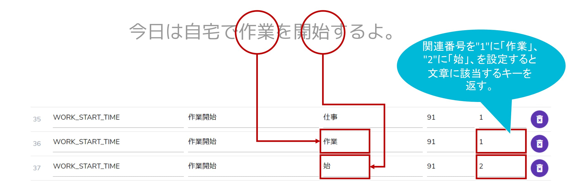

# コマンド機能について

## 利用方法

### **文章中の単語と機能を連動させる**

コマンド機能は文章中に設定した単語が登場した場合、登録したコマンドIDを返却します。

### **項目説明**

| **項目** | **説明**                                       |
| ------ | -------------------------------------------- |
| コマンドID | レスポンス時に返却されるコマンドID。                          |
| コマンド名  | レスポンス時に返却されるコマンド名。コマンド名はコマンドIDと1対1に設定してください。 |
| 単語     | 登録した単語が文章中に含まれた場合にコマンドIDを返却します。              |
| 優先度    | 検索時に複数のコマンドIDが該当した場合の優先度。(0〜99)              |
| 関連番号   | 複数の単語を検索させる場合の単語同士を関連付けするための番号。(0〜99)        |

### **登録・更新方法**

コマンド機能の登録・更新は以下から設定します。


[http://app.cotogoto.ai/webapi/console](http://app.cotogoto.ai/webapi/console)


