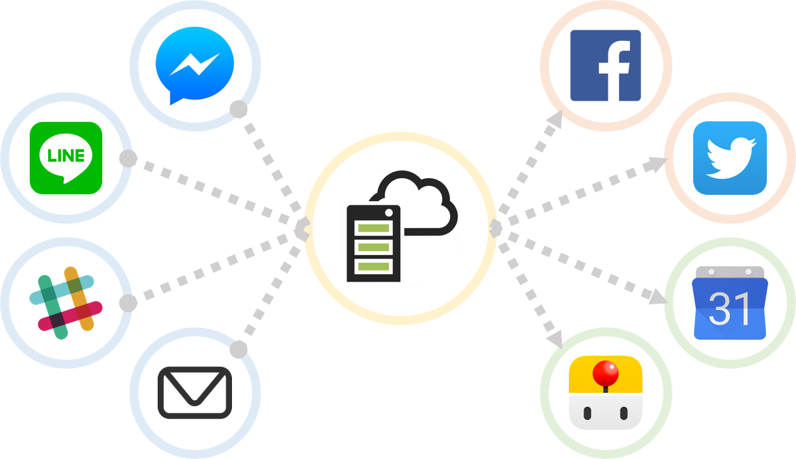

# 各種連携サービスについて

## 1. CotoGotoと様々なサービスの連携

&#x20;CotoGotoは多くのサービスと連携できるため、FacebookやTwitterから作業の開始・終了を通知したり、LINEやSlackのBotを使ってCotoGotoを操作したり、Googleカレンダーで作業結果を可視化したりできます。これらの機能はCotoGotoにログインして設定することで利用できます。

## 2. Twitterとの連携

### 【インポート機能】

CotoGotoはTwitterからツイートを取り込むことができ、モチベーション解析に役立てることができます。

## 3. LINE Bot連携

### 【ボット連携】

LINEと連携することで、CotoGotoに記録を残すことができます。日常の会話はモチベーション解析に使用されます。

## 4. Slack Bot連携

### 【ボット連携】

Slackと連携することで、CotoGotoに記録を残すことができます。日常の会話はモチベーション解析に使用されます。

## 5. Googleアシスタント（Google Home）連携

### 【ボット連携】

Googleアシスタントと連携することで、CotoGotoに記録を残すことができます。日常の会話はモチベーション解析に使用されます。

## 6. Alexa連携

### 【ボット連携】

Alexaと連携することで、CotoGotoに記録を残すことができます。日常の会話はモチベーション解析に使用されます。

## 7. Googleカレンダー連携

### 【カレンダー連携】

Googleカレンダーと連携することで、作業実績をカレンダーに登録できます。カレンダーから作業実績を確認できるため、作業状況の把握が容易になります。リマインダーも連携されます。

## 8. Trello連携

### 【リマインド連携】

Trelloと連携することで、リマインダーをTrelloに登録できます。Trelloからリマインダーの管理ができるので、タスク達成が簡単になります。

## 9. メール連携

### 【メール連携】

メールと連携することで、メールでCotoGotoに記録を残すことができます。日常の会話はモチベーション解析に使用されます。

## 10. 最後に

AIとの会話のコツを参考に会話を楽しみましょう。利用可能なメールアドレスは、最初に登録したメールアドレスと「アカウント設定」のモバイルに設定したメールアドレスでやりとりが可能です。

CotoGotoの多様な連携機能を利用して、より効果的なタスク管理やモチベーション維持を実現しましょう。各サービスとの連携は、簡単に設定できるので、日々の生活や仕事に役立ててください。これらの連携を活用することで、CotoGotoを最大限に活用し、生産性の向上やタスク達成に繋げることができます。

