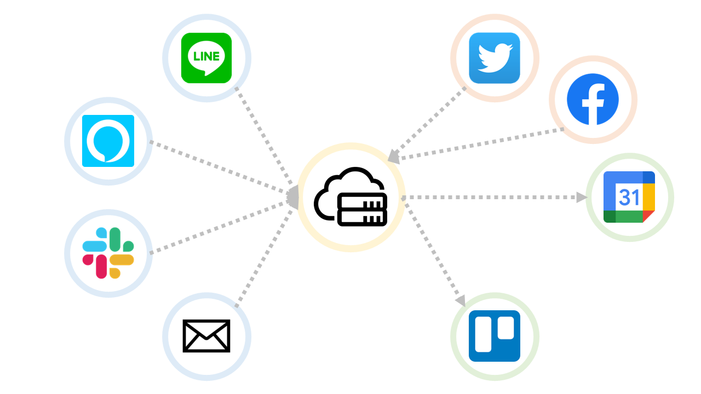

# 各種連携サービスについて

## 1. CotoGotoと様々なサービスの連携

&#x20;CotoGoto（コトゴト）は、さまざまなサービスとの連携に対応しています。これらの連携サービスを利用することで、CotoGotoはあなたの日常生活や仕事環境により適応し、より効果的な作業管理をサポートします。各サービスとの連携は簡単に設定でき、個人やチームのニーズに合わせてカスタマイズが可能です。これにより、作業管理やタスクの進捗状況をリアルタイムで把握し、生産性を向上させることができます。

<figure><figcaption></figcaption></figure>

## 2. LINE Bot連携

### 【ボット連携】

LINEと連携することで、LINEからボットと会話を通じてCotoGotoに記録を残すことができます。これにより、スマートフォンで手軽に作業管理ができるようになります。

## 3. Twitterとの連携

### 【インポート機能】

Twitterと連携することで、日々のつぶやきをCotoGotoに取り込むことができます。これにより、モチベーションの解析などに活用できます。

## 4. Facebookとの連携

### 【インポート機能】

Facebookと連携することで、Facebookに投稿した内容をCotoGotoに取り込むことができます。これも日々の解析に役立てることができます。

## 5. Slack Bot連携

### 【ボット連携】

Slackと連携することで、Slackからボットと会話を通じてCotoGotoに記録を残すことができます。チームでの作業管理が簡単になります。。

## 6. Alexa連携

### 【ボット連携】

Alexaと連携することで、Alexaと会話を通じてCotoGotoに記録を残すことができます。こちらも音声で手軽に作業管理ができます。

## 7. Trello連携

### 【リマインド連携】

Trelloと連携することで、リマインドをTrelloに登録することができます。Trello側からリマインドの管理ができるので、タスク管理が簡単になります。

## 8. Googleカレンダー連携

### 【カレンダー連携】

Googleカレンダーと連携することで、作業実績をカレンダーに登録することができます。カレンダーから作業実績を確認できるので、作業状況の把握が分かりやすくなります。

## 9. メール連携

### 【メール連携】

メールと連携することで、メールでCotoGotoに記録を残すことができます。日常の会話はモチベーション解析に使用されます。

## 10. 最後に

AIとの会話を楽しみ、効果的に活用するためのコツは以下の通りです。

* 明確な質問をする: AIに対する質問は、具体的で明確にすることが重要です。これにより、AIが適切な回答を提供しやすくなります。
* 短い文章を使用する: 長い文章や複雑な表現は、AIが理解しにくい場合があります。短くてシンプルな文章を使用して、情報を伝えましょう。
* 誤解を解消する: AIが誤解した場合、正確な情報を再度伝えるか、質問を別の方法で表現してみましょう。
* 柔軟なアプローチ: AIは完璧ではありません。回答が不十分な場合は、質問を変えてみるか、別の言い回しを試してください。
* 連携サービスを活用する: CotoGotoの連携機能を活用し、各サービスとのやりとりを効果的に行いましょう。
* メールアドレスの確認: 登録したメールアドレスや「アカウント設定」のモバイルに設定したメールアドレスを使用して、AIとのやりとりが可能です。これを確認して、適切なメールアドレスでやりとりを行いましょう。

CotoGotoの多様な連携機能を利用して、効果的なタスク管理やモチベーション維持を実現しましょう。各サービスとの連携は簡単に設定できますので、日々の生活や仕事に役立ててください。これらの連携を活用することで、CotoGotoを最大限に活用し、生産性の向上やタスク達成に繋げることができます。

