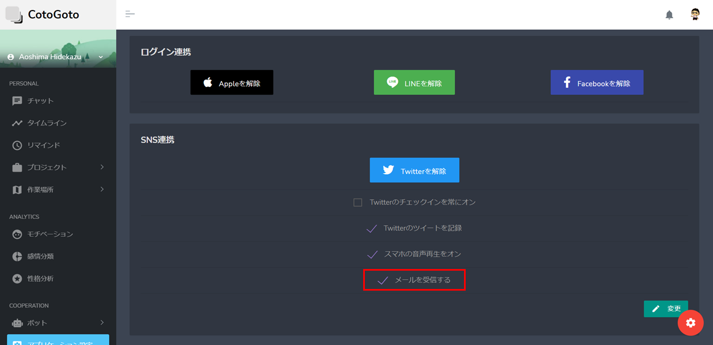

# FAQ

## Q1: 作業内容の入力方法は何ですか？

作業内容の入力については、以下の機能を利用することができます：

1. **チャット**: ノビィ（人工知能）との会話を通じて、作業の開始・終了、休憩の開始・終了を登録できます。チェックインのボタンを押すことでこれらを行うことができます。
2. **タイムライン**: 日々の作業記録が表示され、作業時間の変更やコメントの修正もこちらから行えます。また、登録忘れなどがあった場合には、こちらから作業の再登録も可能です。
3. **プロジェクト設定**: プロジェクトの登録・編集・削除を行います。期間を設定することで、状況の登録時にプロジェクトがフィルタリングされます。
4. **作業場所設定**: 作業場所の登録・編集・削除を行います。

これらの機能を利用して、作業内容をCotogotoに入力することができます。具体的な操作方法については、各機能の「使い方」を参照してください。

## Q2: 作業時間の登録についてはどのような仕様になっていますか？

作業時間については、タイムトラッキングの整合性を担保するため、時間帯の重複はできない仕様になっています。一つの作業でプロジェクトを登録する場合は、プロジェクトを複数選択してください。

## Q3. Line Botとの連携方法について 

LINE Botを利用するためには、CotoGotoに登録済みである必要があります。

LINE連携が行われていない場合は、画面左側サイドメニューのアプリケーション設定からLINEと連携を行い、その後、LINE Botからログイン画面を表示させて連携を行うことで、利用可能となります。

それ以外の場合は、以下のようなエラーメッセージが出ます。

## Q4.  Alexa や Slack などのプロジェクトの呼び出しについて 

&#x20;Alexa や Slack などから、作業開始をするときにプロジェクトの選択を行うためには、プロジェクト設定画面から、呼び方を設定することで、作業開始時にプロジェクトを紐付けることができます。

設定後に「コトゴトの作業を開始するよ。」こんな感じで呼びかけるとプロジェクトが紐付くようになります。

.png>)

## Q5. メール通知の設定変更について 

CotoGotoからメール通知がありますが、メールの受信をしたくない場合は、「[アプリケーション設定](https://app.cotogoto.ai/3\_0/setApplication#!)」画面からメールを受信するのチェックを外すことで、メール通知が止まります。

<figure><figcaption></figcaption></figure>

## **Q6. 各サービス連携の解除方法** 

各サービスとの連携を解除をするには、『[アプリケーション設定](https://app.cotogoto.ai/3\_0/setApplication#!)』画面から「ログイン連携」「SNS連携」「カレンダー連携」「リマインド連携」のサービス解除のボタンを押すことで、連携が解除されます。

<figure><figcaption></figcaption></figure>

1. ログイン連携\
   ・Apple\
   ・Line\
   ・Facebook
2. SNS連携\
   ・Twitter
3. カレンダー連携\
   ・Googleカレンダー
4. リマインド連携\
   ・Trello

また、左サイドメニューの「Bots」内の画面からは、

* Line メッセンジャー
* Slack
* Googleアシスタント
* Alexa

連携解除が行えます。

## **Q7.** Discordとの連携方法について 

Discod Botを利用するためには、CotoGotoに登録済みである必要があります。

Discod 連携が行われていない場合は、画面左側サイドメニューのボットのDiscordから連携を行い、その後、DiscordサーバーにDiscod Botを招待することで、利用可能となります。

<figure><figcaption></figcaption></figure>

## **Q8. 退会方法** 

退会についてはブラウザからWebページにログイン後、『[アカウント](https://app.cotogoto.ai/3\_0/account)』の『[アカウントを廃止する場合](https://app.cotogoto.ai/3\_0/abolition)』から遷移することで、退会することができます。



.png>)
