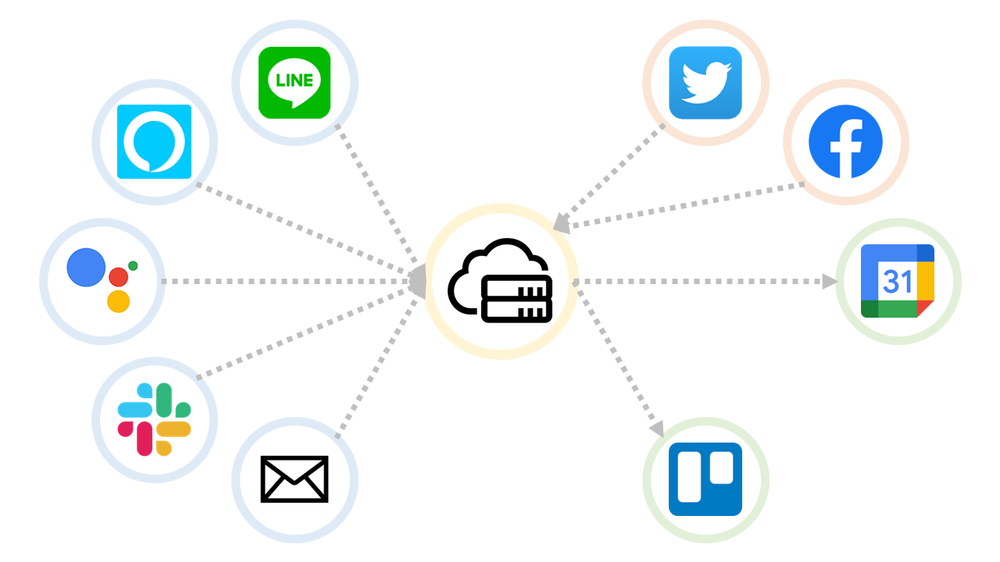

# FAQ

## **作業の登録について** 

作業時間については、タイムトラッキングの整合性を担保するため、時間帯の重複はできない仕様になっています。一つの作業でプロジェクトを登録する場合は、プロジェクトを複数選択してください。

## Line Botとの連携方法について 

LINE Botは、Webの画面にログイン後、画面右上のアプリ設定からLINEと連携を行い、その後、LINE Botからログイン画面を表示させて連携を行うことで、利用可能となります。

それ以外の場合は、以下のようなエラーメッセージが出ます。

## Gcall-the-projectoogle Home や Alexa などのプロジェクトの呼び出しについて 

Google Home や Alexa などから、作業開始をするときにプロジェクトの選択を行うためには、プロジェクト設定画面から、呼び方を設定することで、作業開始時にプロジェクトを紐付けることができます。

設定後に「コトゴトの作業を開始するよ。」こんな感じで呼びかけるとプロジェクトが紐付くようになります。

.png>)

## メール通知の設定変更について 

CotoGotoからメール通知がありますが、メールの受信をしない場合「[アプリケーション設定](https://app.cotogoto.ai/3\_0/setApplication#!)」画面からメールを受信するのチェックを外すことで、メール通知が止まります。

## **退会方法** 

退会についてはブラウザからWebページにログイン後、『アカウント』の『アカウントを廃止する場合』から遷移することで、退会することができます。



.png>)
